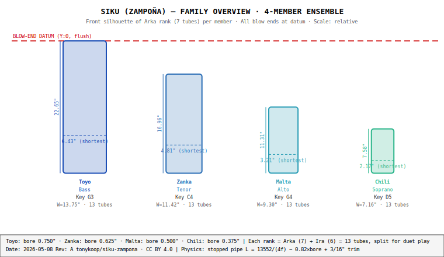
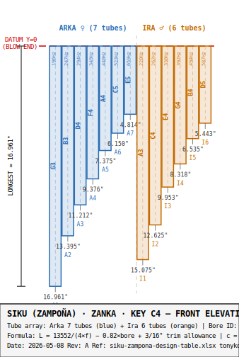
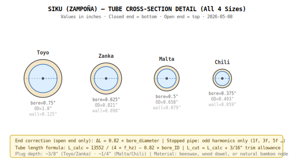

# Siku (Zampoña) — Capstone Deck

**Heifer Zephyr · instrument-maker-v4 · packet v4.3 · 2026-05-08**

---

# Project Intent

The siku is the Andean panpipe — one of the oldest continuously played instruments in the world, with archaeological specimens from Tiwanaku and Nazca dating to at least 1500 BCE. It is played in interlocking arka/ira pairs, embodying *yanantin*, the Aymara philosophy of complementary pairing: neither rank alone contains the full scale; two players weave a single melody together.

This project documents a contemporary workshop interpretation of the siku as a four-member family (Toyo bass / Zanka tenor / Malta alto / Chili soprano), built using parametric acoustic design, CNC-routed cherry frame rails, and bamboo or PVC tubes. The primary build target is the Zanka (key of C, tenor voice), the traditional melodic lead in Andean ensembles.

**Goal:** A fully-documented, reproducible build packet for the complete siku family, publishable as a GitHub portfolio instrument and buildable from this packet alone.

---

# Instrument Overview

The siku is a stopped cylindrical pipe instrument. Each tube is open at the top (blow end) and closed at the bottom (beeswax plug or natural bamboo node). Stopped pipes produce only odd harmonics — 1f, 3f, 5f — giving the siku its characteristic hollow, fundamental-rich timbre.

The instrument is played by blowing across the open end of each tube. Pitch is fixed at manufacture; the only playing variable is embouchure angle. A complete instrument consists of two bound ranks (arka and ira) played by two performers or by a single player alternating between ranks.



---

# Family Specification

| Member | Key | Bore | OD | Longest Tube | Frame Width | Primary Use |
|---|---|---|---|---|---|---|
| Toyo | G3 | 0.750" | 1.000" | 22.646" | 13.750" | Bass ensemble voice |
| **Zanka** | **C4** | **0.625"** | **0.821"** | **16.961"** | **11.423"** | **Primary melodic voice** |
| Malta | G4 | 0.500" | 0.658" | 11.315" | 9.304" | Alto ensemble voice |
| Chili | A4 | 0.375" | 0.493" | 7.565" | 7.159" | Soprano ensemble voice |

All four members are acoustically designed from the same formula; only bore diameter and root pitch change.

---

# Acoustic Design

The core formula for all 52 tubes across the four-member family:

```
L_calc = 13552 / (4 × f_hz) − 0.82 × bore_ID
L_cut  = L_calc + 3/16"  (tuning trim allowance)
```

- **Speed of sound:** 13,552 in/s (68°F shop standard)
- **End correction:** 0.82 × bore_ID (empirical; bundles embouchure effects)
- **Stopped pipe:** odd harmonics only (1f, 3f, 5f…)
- **Tuning:** A4 = 440 Hz, equal temperament

Sanity check: `L_calc(A4=440Hz, bore=0.625") = 13552/(4×440) − 0.82×0.625 = 7.188"` ✓

The 0.82 end-correction coefficient is an empirical convention (vs. the theoretical 0.3×d) that bundles embouchure geometry effects and produces well-tuned tubes without per-player adjustment. Risk AC-05 in `risks.md` documents the accuracy envelope.

---

# Arka / Ira Split

The interlocking split is the defining acoustic and cultural feature of the siku:

| Rank | Role | Notes (Zanka) | Semitone offsets from root |
|---|---|---|---|
| Arka (leader ♀) | 7 tubes | G3 B3 D4 F4 A4 C5 E5 | 0 4 7 10 14 17 21 |
| Ira (follower ♂) | 6 tubes | A3 C4 E4 G4 B4 D5 | 2 5 9 12 16 19 |

Combined: G Mixolydian scale (G A B C D E F♮ G A B C D E). Neither rank alone is playable as a melody; they are designed to be played together.

This split is not an engineering choice — it is *yanantin* made physical.

---

# Tube Layout — Zanka



The 13 Zanka tubes span G3 (196 Hz, 17.15") to E5 (659 Hz, 4.81") across a frame width of 11.423". Arka tubes are positioned at semitone offsets {0,4,7,10,14,17,21}; Ira at {2,5,9,12,16,19}.

---

# Cross-Section Detail



All four family members share the same stopped-pipe acoustics. The difference is bore diameter, which scales the tube lengths by a constant factor (plus a small end-correction offset). Wall thickness is sized to maintain structural integrity at the tube spacing used in each rank.

---

# Frame and Binding

Each rank consists of 13 tubes held in two cherry or walnut frame rails. Rails are CNC-routed with pocket width = tube OD − 0.005" (light interference before glue), pocket depth = OD/3, and pitch = OD + 1/16" (one tube gap between centers).

Binding cord (waxed linen or nylon) wraps the tube array in 3+ passes per tube and is knotted at the rail ends. No hardware is used — the instrument is entirely wood, bamboo/PVC, beeswax, and cord.

---

# Build Sequence

1. **Stock verification** — measure bore ID and OD; record in `validation.csv`
2. **Tube cutting** — story stick (bamboo) or digital stop (PVC); 52 tubes across 4 members
3. **Closed-end sealing** — beeswax pour in plywood sealing fixtures; 30 min cure
4. **First-pass tuning** — measure all tubes; record cents deviation
5. **Frame rail fabrication** — CNC-route 13 pockets; dry-fit before glue
6. **Assembly and binding** — seat tubes; wrap with waxed cord; square-knot finish
7. **Trim-tuning** — file/saw to ±5 cents; update `validation.csv`
8. **Finishing** — Danish oil on rails; tung oil wipe on bamboo tubes

Full protocol: `assembly-manual.md` · CNC parameters: `cnc/setup-sheet.md`

---

# Manufacturing Notes

**Key jig decisions:**
- Toyo long tubes (22.6"): headstock-driven deep bore on lathe (prevents drill wander)
- Zanka tubes (to 17"): conventional tailstock drill on lathe
- Malta/Chili tubes (to 11"): drill press + V-block
- Frame rail pockets: CNC router preferred; router table + index stops acceptable
- Sealing stand: drilled plywood, one per family member (4 total)

See `jig-decision.md` for full rationale and `cnc/setup-sheet.md` for machine datums and tooling.

---

# Bill of Materials Summary

| Member | Tubes | Frame Rails | Cord + Plugs | Est. Total |
|---|---|---|---|---|
| Toyo | $6.50 | $12.00 | $1.55 | ~$20 |
| Zanka | $5.20 | $10.00 | $1.24 | ~$17 |
| Malta | $4.55 | $8.00 | $0.93 | ~$14 |
| Chili | $3.90 | $7.00 | $0.75 | ~$12 |
| Shared tools | — | — | $28.00 | $28 |

Material cost for a single Zanka arka+ira build: ~$17 (plus $28 shared tools, once). Full four-member family: ~$91 before finish and consumables.

Full BOM: `bom.csv` · Sourcing: `sourcing.csv`

---

# Key Risks and Mitigations

| Risk ID | Description | Severity | Mitigation |
|---|---|---|---|
| AC-04 | Chili Arka-7 (F#6, 1.982") borderline playable | H | Build as 11-tube Chili; omit top 2 tubes |
| AC-01 | Bamboo bore variance (±0.015" typical) | M | Measure all tubes before cutting; adjust L_calc per measured bore |
| AC-02 | Temperature drift (±10°F → ±0.9%) | M | Tune and play at same temperature; note shop temp in validation.csv |
| ST-01 | Rail pocket undersize causing tube cracking | M | First pocket is always a test pocket; verify fit before batch routing |
| ER-01 | Yanantin not explained in public documentation | H | See `resources.md §Provenance`; required before any public publish |

Full risk register: `risks.md` (11 risks total).

---

# Open Items / Next Actions

- [ ] **Photos:** All 36 shots in `photo-shotlist.md` pending. HERO-03 (Zanka arka beauty shot) is the README hero image.
- [ ] **Chili Arka-7 prototype:** Build and test the 1.982" F#6 tube before committing full Chili production. Empirical test resolves risk AC-04.
- [ ] **Wolfram recordings:** Record AudioGenerator output for arka and ira ranks; embed in build-log site.
- [ ] **OpenSCAD model:** `cad/siku-openscad-starter.scad` is TBD per `drawing-brief.md`.
- [ ] **Sourcing confirmation:** Verify current bamboo cañahueca availability; lead time 2–4 weeks for import suppliers.
- [ ] **Validate measured tube lengths:** Once first Zanka prototype is built, fill in `validation.csv` measured_hz column and confirm ±5 cent tolerance across all 13 tubes.

---

# Cultural Provenance

The siku is a living cultural artifact, not simply a historical instrument. Aymara and Quechua communities in Bolivia and Peru continue to build and play siku today.

**Before publishing this build:**
1. Describe as "Andean Aymara/Quechua in origin" — not "Incan" or "South American"
2. Do not claim cultural authenticity — this is a contemporary workshop interpretation
3. Explain *yanantin* — the interlocking duet is not decorative; it is cultural philosophy
4. Do not use "traditional" or "authentic" in marketing or product descriptions
5. The CC BY 4.0 license covers the engineering documentation, not the cultural tradition

Primary reference: Thomas Turino, *Moving Away from Silence* (Chicago, 1993).

---

# Packet Summary

**Repo:** `tonykoop/siku-zampona` · **License:** CC BY 4.0 · **Packet:** v4.3 root-mode

| Deliverable | Status |
|---|---|
| design.md | ✅ Complete |
| family-spec.csv (4 members, 13 tubes each) | ✅ Complete |
| bom.csv / sourcing.csv / cut-list.csv | ✅ Complete |
| validation.csv (per-tube targets) | ✅ Complete |
| assembly-manual.md (8 phases) | ✅ Complete |
| risks.md (11 risks) | ✅ Complete |
| jig-decision.md (5 decisions) | ✅ Complete |
| cnc/setup-sheet.md + operations.csv | ✅ Complete |
| wolfram/instrument-model.wl | ✅ Complete |
| drawings/ (10 SVGs) | ✅ Complete |
| site/index.html | ✅ Complete |
| resources.md + photo-shotlist.md | ✅ Complete |
| Photos | ⏳ Pending build |
| OpenSCAD model | ⏳ TBD |
| Wolfram audio recordings | ⏳ TBD |

Part of the [Heifer Zephyr](https://github.com/tonykoop/instrument-maker) instrument-maker catalog.
